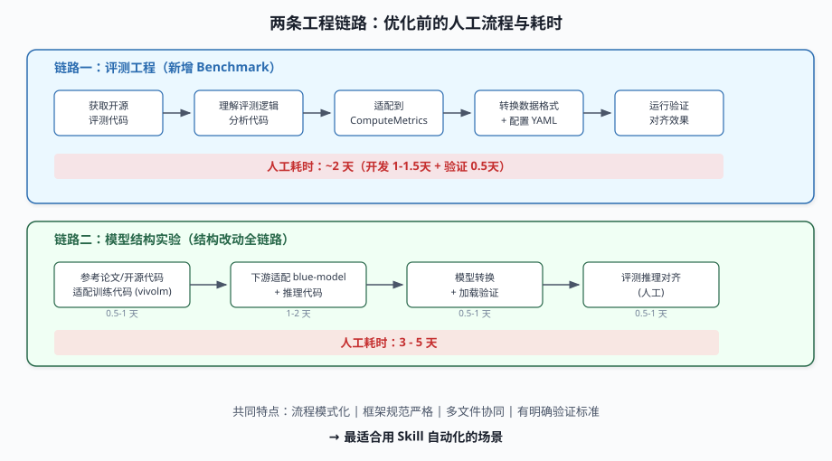
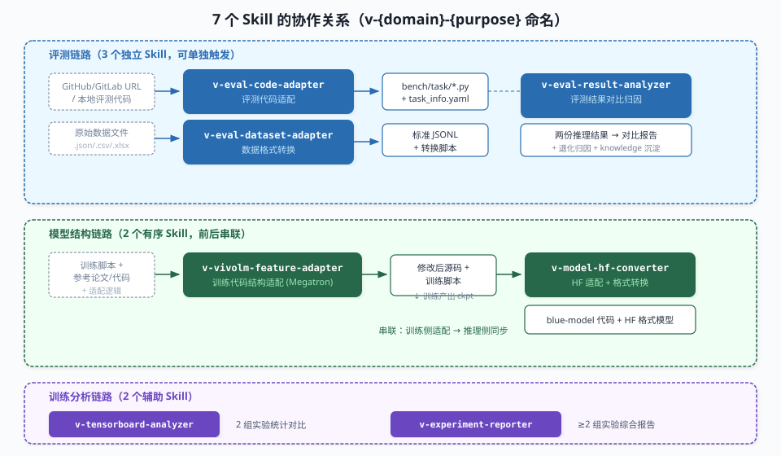
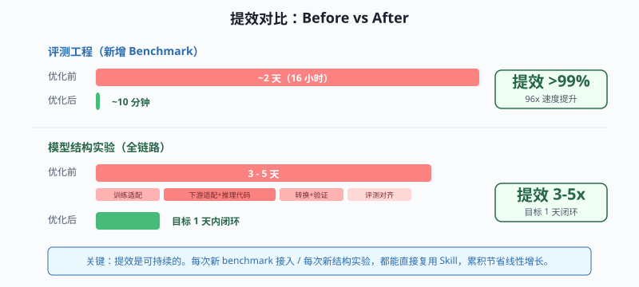
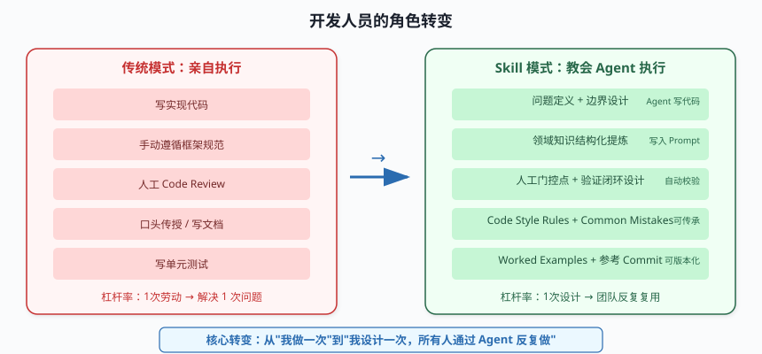
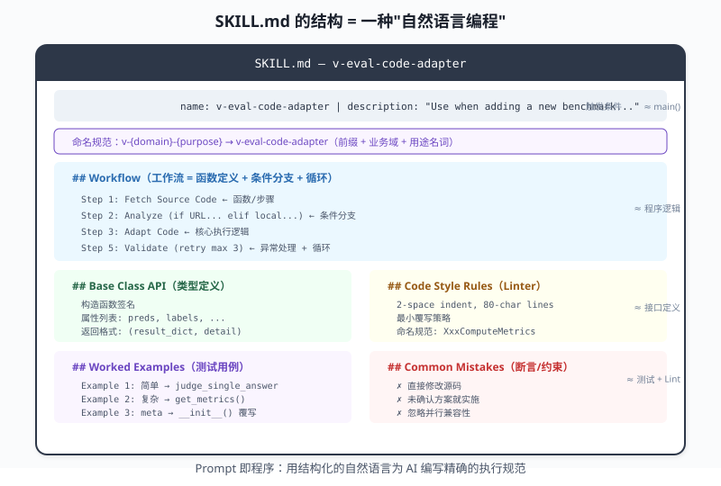
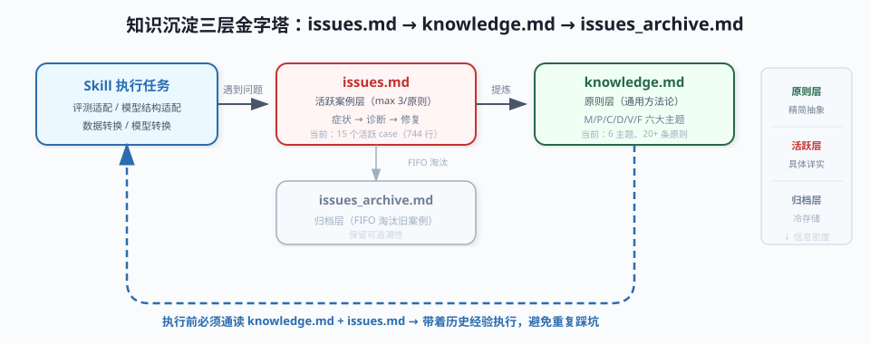
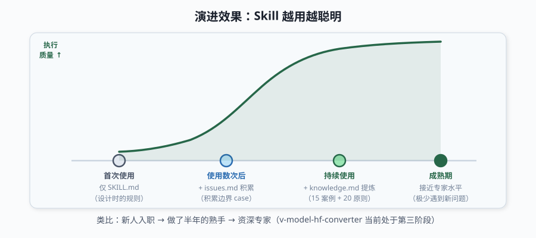

# 教会 Agent 做工程：评测与模型适配的 Skill 实践

## 一、背景

大模型工程中有大量重复性高、规范性强、但又需要专业知识的任务。我们选取了两个典型场景，通过设计 BlueCode Skill 让 AI Agent 按照专家级标准自动完成这些工作。

**场景一：评测工程**

新增一个 benchmark 需要：获取开源评测代码 → 理解评测逻辑 → 适配到内部 `ComputeMetrics` 框架 → 转换数据格式 → 配置 YAML → 运行验证。全程人工操作约需 2 天。

**场景二：模型结构实验**

算法同事参考论文修改模型结构后：适配训练代码 (vivolm/Megatron) → 同步到推理框架 (blue-model/HuggingFace) → 模型格式转换 (m2h) → 加载验证。全程人工操作约需 3-5天。



这两个场景的共同特点：
- 流程模式化，每次执行步骤类似
- 需要遵循严格的框架规范和代码风格
- 涉及多个文件/工程的协同修改
- 有明确的验证标准

这正是 Skill 的最佳应用场景——**将专家的决策过程和领域知识编码为 AI Agent 的执行规范**。

## 二、我们做了什么

### 2.1 Skill 体系概览

我们围绕评测和模型两条工程链路，共设计了 **7 个 Skill**，统一放置在 `skills/` 目录下，遵循 `v-{domain}-{purpose}` 命名规范：



**评测链路（3 个 Skill）：**

| Skill | 职责 | 输入 | 输出 |
|-------|------|------|------|
| `v-eval-code-adapter` | 评测代码适配 | GitHub/GitLab URL / 本地代码 | `bench/task/*.py` + YAML 配置 |
| `v-eval-dataset-adapter` | 数据格式转换 | 原始数据文件 (.json/.csv/.xlsx) | 标准 JSONL + 转换脚本 |
| `v-eval-result-analyzer` | 评测结果对比归因 | 两份推理结果文件 | 对比报告 + 退化归因 |

**模型结构链路（2 个 Skill）：**

| Skill | 职责 | 输入 | 输出 |
|-------|------|------|------|
| `v-vivolm-feature-adapter` | 训练代码结构适配 | 训练脚本 + 参考论文/代码 | 修改后源码 + 新训练脚本 |
| `v-model-hf-converter` | HF 模型适配 + 格式转换 | checkpoint + 转换脚本 | blue-model 代码 + HF 模型 |

**训练分析链路（2 个 Skill）：**

| Skill                    | 职责                  | 输入        | 输出            |
| ------------------------ | ------------------- | --------- | ------------- |
| `v-tensorboard-analyzer` | 两组实验 TensorBoard 对比 | 2 个实验日志路径 | 统计分析报告        |
| `v-experiment-reporter`  | 多组实验综合对比及报告输出       | ≥2 个实验配置  | Markdown 对比报告 |

本文重点介绍核心的评测链路和模型结构链路（前 5 个 Skill），训练分析链路作为辅助能力不展开。

### 2.2 Skill 的本质

每个 Skill 本质上是一份**结构化的专家工作手册**（SKILL.md），包含：

- **工作流定义**：步骤、分支、循环、人工门控点
- **领域知识**：框架 API、代码规范、命名约定、并行兼容性要求
- **决策逻辑**：什么情况用什么策略（决策树）
- **质量保障**：自动校验、验证步骤、错误处理
- **反面教材**：Common Mistakes 表格，防止典型错误

Agent 加载 Skill 后，按照其中定义的流程和规范自主执行任务，在关键决策点与用户交互确认。

## 三、提效效果



### 3.1 评测工程

| 指标 | 优化前 | 优化后 | 提效 |
|------|--------|--------|------|
| 评测集数据准备 + 代码开发 | 1 - 1.5 天 | ~10 分钟 | **>99%** |
| 验证对齐 | 0.5 天 | 包含在流程中 | - |
| **端到端总计** | **~2 天** | **~10 分钟** | **>99%** |

已有多个团队通过评测适配 Skill 接入了业务评测集到 BlueLM 评测体系，功能验收通过。

### 3.2 模型结构实验

| 环节 | 优化前 | 优化后 |
|------|--------|--------|
| 训练代码开发（结构适配） | 0.5 - 1 天 | Skill 辅助完成 |
| 下游适配（blue-model + 推理代码） | 1 - 2 天 | Skill 辅助完成 |
| 模型转换 + 加载验证 | 0.5 - 1 天 | Skill 辅助完成 |
| 评测推理对齐 | 0.5 - 1 天 | 人工 |
| **总计** | **3 - 5 天** | **目标 1 天内闭环** |

- `v-vivolm-feature-adapter` 已交付算法团队验收，训练 loss 收敛正常
- `v-model-hf-converter` 开发完成，评测指标可对齐算法自测值

### 3.3 效果的可持续性

这些提效不是一次性的。每次有新 benchmark 需要接入、每次有新的模型结构实验，都能直接复用 Skill。随着使用次数增加，累积节省的人力成本是线性增长的。

## 四、开发人员的价值：从"写代码"到"设计系统"

Skill 的代码实现主要由 Agent 完成，那开发人员的核心价值是什么？



### 4.1 问题定义与边界设计

决定"自动化什么"和"不自动化什么"比实现自动化本身更重要：

- 识别哪些环节适合自动化（重复、模式化）、哪些必须保留人工决策（方案确认、架构选择）
- 确定 Skill 的拆分粒度——评测链路拆为"代码适配"、"数据转换"、"结果分析"三个独立 Skill，可单独触发；模型链路拆为"训练侧适配"和"下游同步"两个有序 Skill
- 定义清晰的输入输出契约和触发条件

### 4.2 领域知识的结构化提炼

这是最核心的价值——**将隐性的专家经验显式化**：

**评测工程的知识提炼：**
- `ComputeMetrics` 基类的完整 API 契约（构造函数、属性、helper 方法、返回格式）
- "最小覆写策略"的决策树：仅答案比较不同 → 覆写 `judge_single_answer()`；自定义提取 → 覆写 `get_metrics()`
- 字段映射别名表（`question/input/query/prompt` → `问题`）

**模型结构工程的知识提炼：**
- 8 条代码风格铁律（`--v-` 前缀、无损兼容、并行兼容、独立模块...）
- 源码修改策略的决策树：耦合深 → 条件判断；耦合浅 → 新建 `v_` 前缀文件
- 模型转换的隐性规则（新增参数通过 `_set_arg` 白名单恢复而非脚本新增）

这些知识原本只存在于资深工程师的脑中。Skill 让它们变成**可复用、可传承、可版本化的团队资产**。新人通过 Agent 也能按照专家标准执行任务。

### 4.3 质量工程设计

设计"怎么保证 Agent 做对了"：

| 质量手段 | 评测 Skill | 模型结构 Skill |
|---------|-----------|---------------|
| 自动校验 | 语法 / Import / YAML 三项检查 | 训练 200 步验证 / 推理加载验证 |
| 人工门控 | 字段映射确认、任务命名确认 | 适配方案确认（修改文件、并行分析） |
| 失败重试 | 校验失败自动修复（最多 3 次） | 代码确认循环 |
| 基准对比 | 与人工编写版本对比评测结果 | 参考 commit 作为黄金标准 |

### 4.4 角色的本质转变

**开发人员的价值从"亲自执行"转变为"教会 Agent 正确执行"。** 这要求更高的抽象能力——把自己做事的完整决策过程提炼出来，清晰到 Agent 能复现。比自己写代码更难，但杠杆率更高：一次设计，团队所有人都能通过 Agent 按同样标准执行。

## 五、Skill 设计的关键经验

### 5.1 命名规范：三段式让 Skill 可管理

当 Skill 数量增长到 7 个、且与社区通用 Skill（如 `test-driven-development`、`systematic-debugging`）共存于同一 Agent 环境时，命名混乱会导致难以识别、难以分组。我们设计了 `v-{domain}-{purpose}` 三段式命名规范：

| 段 | 含义 | 取值示例 |
|---|---|---|
| 前缀 `v-` | 团队标识（vivo），区别于外部 Skill | — |
| 业务域 | 所属领域 | `eval` / `model` / `vivolm` / `tensorboard` / `experiment` |
| 用途（名词） | Skill 做什么 | `-adapter` / `-analyzer` / `-converter` / `-reporter` |

**收益：**
- **可识别**：Agent Skill 列表中 `v-` 前缀一眼识别为团队内部能力，不与社区 Skill 混淆
- **可分组**：按 domain 自然归类——`v-eval-*` 三兄弟负责评测全链路，`v-model-*` + `v-vivolm-*` 覆盖模型适配
- **可预测**：看名字即知能力类型——`-analyzer` 是分析类、`-adapter` 是适配类、`-converter` 是转换类
- **防冲突**：避免与社区 Skill 命名碰撞

重构前后对比：

```
旧命名（无规范）              新命名（三段式）
auto-eval-adapter          → v-eval-code-adapter
auto-dataset-adapter       → v-eval-dataset-adapter
adapt-model                → v-vivolm-feature-adapter
blue-model-and-convert-adapt → v-model-hf-converter
```

命名规范看似小事，但它是 Skill 工程化管理的第一步——当团队的 Skill 资产从个位数增长到两位数时，系统化的命名让检索、分组、维护都变得可控。

### 5.2 Prompt 就是程序



Skill 的 SKILL.md 本质是一种"自然语言编程"：

| 编程概念 | SKILL.md 中的对应 |
|---------|------------------|
| 函数/步骤 | Step 1, Step 2, ... |
| 条件分支 | "如果是 URL... 如果是本地文件..." |
| 循环 | "询问用户是否调整，如需调整重新列出" |
| 异常处理 | Error Handling 表格 |
| 类型定义 | Input Parameters 表格、Output Schema |
| 测试用例 | Worked Examples |
| Linter 配置 | Code Style Rules |
| 断言 | 验证步骤（语法检查、Import 检查） |

### 5.3 Worked Examples 比规则更有效

在 `v-eval-code-adapter` 中提供了三个递进复杂度的完整示例（简单覆写 → 完整重写 → 使用 meta 字段）。在 `v-vivolm-feature-adapter` 中提供了 Gemma4 per-layer scalar 的完整适配示例（含输入脚本和输出脚本对比）。

实践表明：**有完整示例的 Skill 输出质量远高于纯规则描述**。示例传递的不仅是格式，更是"什么情况用什么策略"的隐性决策逻辑。

### 5.4 反面教材的约束力强于正面规则

Common Mistakes 表格在实际使用中的约束效果甚至优于正面规则：

```markdown
| 错误 | 正确做法 |
|------|----------|
| 直接修改 Megatron-LM 源码 | 新建 v_ 前缀文件 |
| 关闭新特性时改变了原有行为 | 条件守卫保证与原逻辑一致 |
| 未确认 submodule 版本就开始适配 | Step 2 必须确认代码版本 |
```

LLM 对"不要做什么"的指令遵循度很高。

### 5.5 人工门控不是形式主义

两个链路的 Skill 都在方案确认步骤设置了强制人工门控。这不是"让用户看一眼"——模型结构修改影响面大，评测逻辑理解偏差会导致指标不可信。**关键决策点保留人工判断，是平衡效率和可控性的必要设计**。

### 5.6 工具辅助降低幻觉风险

`v-eval-code-adapter` 配套了完整的 Python 工具链：
- **`code_analyzer.py`**：基于 AST 的代码分析器，提取评测类结构、度量计算模式、答案抽取逻辑、第三方依赖
- **`dep_map.py`**：依赖可用性检查器，区分标准库/已有/需安装
- **`fetcher/`**：GitHub/GitLab 代码获取器，支持 clone 和下载

这些工具为 LLM 提供结构化的分析结果，降低了 LLM 在理解复杂代码时的遗漏和幻觉风险。

设计原则：**当任务变化维度多且难以模板化时（如模型结构适配），让 LLM 发挥理解力；当有明确的结构化模式时（如 AST 分析），用工具提供精确辅助。**

## 六、知识沉淀——让 Skill 越用越聪明

### 6.1 问题：Skill 的知识是静态的

当前 Skill 的规则和经验在设计时一次性写入 SKILL.md。但实际使用中不断会遇到新的边界情况：某个开源评测集的字段格式超出别名表覆盖范围、某个模型结构的并行策略需要特殊处理、某类转换场景总是在同一个地方报错……

这些问题每次都靠用户和 Agent 临场解决，解决了就消散了，下次遇到同样问题还是要重新踩一遍。

### 6.2 机制设计：issues.md → knowledge.md 的三层金字塔

我们在 `v-model-hf-converter` 和 `v-eval-result-analyzer` 中实际落地了知识沉淀机制：



**三层结构（以 `v-model-hf-converter` 为例）：**

| 层级    | 文件                  | 作用                      | 当前规模          |
| ----- | ------------------- | ----------------------- | ------------- |
| 原则层   | `knowledge.md`      | 从 issues 提炼的通用方法论，按主题归类 | 6 大主题、20+ 条原则 |
| 活跃案例层 | `issues.md`         | 具体问题的完整记录（症状→诊断→修复）     | 15 个活跃 case   |
| 归档层   | `issues_archive.md` | FIFO 淘汰的旧案例，保留可追溯性      | 预留，暂未触发淘汰     |

**运作流程：**
1. 执行 Skill 前，Agent 必须先通读 `knowledge.md` 和 `issues.md`
2. 执行中遇到新问题，按模板追加到 `issues.md`
3. 当某条原则下关联的 issue 超过 3 条，最旧的被移入 `issues_archive.md`（FIFO）
4. 定期从 issues 中提炼新原则到 `knowledge.md`
5. 所有更新需列出候选项并经用户确认

**`knowledge.md` 的内容结构（v-model-hf-converter 实际内容）：**

```markdown
## 一、调试方法论 (M1-M4)
- M1. 不要凭印象推断时序与调用链
- M2. 先 grep 既有机制，再考虑绕路实现
- M3. 先看上游有没有现成实现
- M4. 根因优先于"能跑通"

## 二、跨实现模式 (P1-P4)
- P1. 继承+替换 > 从零实现
- ...

## 三、Config 流转 (C1-C4)
- C1. 三处同步原则（_set_arg + v_set_model_config + synchronizer）
- ...

## 四、诊断口诀 (D1-D5)
- D1. 具体错误信号 → 根因映射
- ...
```

### 6.3 实际效果：`v-eval-result-analyzer` 的 knowledge.md

评测结果分析 Skill 的知识库则侧重数据格式经验：

- **score 字段可能是 dict**（用 `综合得分` 做主分数）
- **score=-1 表示评测系统失败**（排除后重算真实 delta）
- **小样本子类别不可信**（n≤3 时不做显著性判断）
- **"表面 delta" vs "真实 delta"** 的区分方法

这些都是实际执行中踩过的坑，沉淀后 Agent 下次直接避开。

### 6.4 与传统知识库的区别

| 维度 | 传统文档/Wiki | Skill knowledge.md |
|------|-------------|-------------------|
| 来源 | 人工撰写和维护 | 从实际执行问题中自然沉淀 |
| 更新频率 | 依赖人工主动更新，容易过时 | 随使用持续积累 |
| 消费方 | 人阅读后理解执行 | Agent 直接读取并参照执行 |
| 格式要求 | 给人看，可以模糊 | 结构化，LLM 可直接消费 |
| 淘汰机制 | 无，只增不减 | FIFO 淘汰保持文档精简 |

### 6.5 效果：从"工具"到"有经验的工具"



类比一个新人和一个做了半年的熟手——他们拿到的工作手册（SKILL.md）是同一份，但熟手脑子里有大量"手册没写但很重要"的经验。knowledge.md 就是让 Agent 也拥有这份经验。

`v-model-hf-converter` 的 issues.md 已积累 15 个实战案例（744 行），knowledge.md 提炼出 6 大主题 20+ 条方法论原则。这些知识覆盖了 tokenizer 路径校验、参数白名单时序、vllm 算子复用、权重加载前缀处理等高频踩坑点——新的适配任务几乎不会再在这些地方卡壳。

Skill 不再是一个静态的指令集，而是一个**随使用持续进化的知识系统**。用得越多，积累的边界 case 越丰富，执行质量越高。

## 七、后续规划

### 7.1 链路串联

当前各 Skill 独立触发。下一步计划实现自动串联：

```
模型结构适配 → 自动触发 blue-model 适配和转换 → 自动触发评测任务拉起
```

实现"模型改动 → 评测结果"的一键闭环。

### 7.2 持续积累领域知识

随着更多 benchmark 接入和模型结构实验，Skill 中的知识库会持续扩展：
- 评测 Skill：更多评测模式的 Worked Examples、更完善的字段别名表
- 模型 Skill：更多并行策略的适配模式、更多模型类型的转换支持
- 推广知识沉淀机制到所有 Skill（目前仅 `v-model-hf-converter` 和 `v-eval-result-analyzer` 已落地）

### 7.3 从个人经验到团队能力

Skill 的最大长期价值：**将个人的专家经验转化为团队的标准化能力**。新成员不需要花数周理解框架规范和适配套路，通过 Agent 即可按照专家标准完成任务。团队的工程效率不再受限于"谁熟悉这个框架"。

## 八、总结

| 维度 | 核心观点 |
|------|---------|
| Skill 是什么 | 将专家决策过程和领域知识编码为 Agent 的执行规范 |
| 开发者做什么 | 问题定义、知识提炼、质量设计——"教会 Agent 正确做事" |
| 提效效果 | 评测接入 2天→10分钟；模型结构链路 3-5天→1天内 |
| 当前规模 | 7 个 Skill 覆盖评测、模型适配、训练分析三条链路 |
| 知识沉淀 | issues.md → knowledge.md 三层金字塔，已有 15 案例 + 20 条原则 |
| 核心经验 | Worked Examples > 规则；反面教材约束力强；人工门控必要 |
| 长期价值 | 个人经验 → 团队资产；一次设计，持续复利 |

Skill 开发的本质不是写代码，而是一种新的软件工程实践——**用结构化的自然语言为 AI 设计精确的执行系统**。开发人员的杠杆率从"我写一次代码解决一次问题"变成了"我设计一次 Skill，团队所有人通过 Agent 都能反复解决同类问题"。
